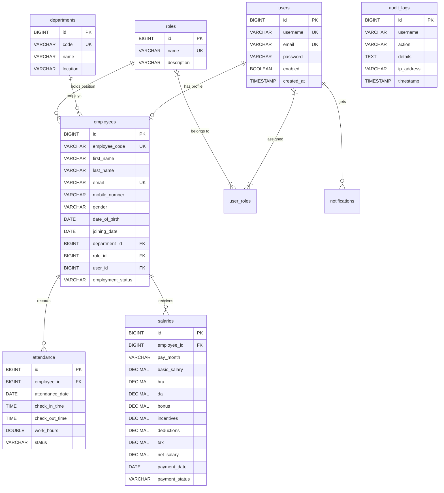

# Entity-Relationship (ER) Diagram

The normalized database schema design for the **Employee Management System** is represented below using Mermaid ER syntax.

```mermaid
erDiagram
    users ||--o| employees : "has profile"
    users }|--|{ user_roles : "assigned"
    roles }|--|{ user_roles : "belongs to"
    
    departments ||--o{ employees : "employs"
    roles ||--o{ employees : "holds position"
    
    employees ||--o{ attendance : "records"
    employees ||--o{ salaries : "receives"
    users ||--o{ notifications : "gets"

    users {
        BIGINT id PK
        VARCHAR username UK
        VARCHAR email UK
        VARCHAR password
        BOOLEAN enabled
        TIMESTAMP created_at
    }

    roles {
        BIGINT id PK
        VARCHAR name UK
        VARCHAR description
    }

    departments {
        BIGINT id PK
        VARCHAR code UK
        VARCHAR name
        VARCHAR location
    }

    employees {
        BIGINT id PK
        VARCHAR employee_code UK
        VARCHAR first_name
        VARCHAR last_name
        VARCHAR email UK
        VARCHAR mobile_number
        VARCHAR gender
        DATE date_of_birth
        DATE joining_date
        BIGINT department_id FK
        BIGINT role_id FK
        BIGINT user_id FK
        VARCHAR employment_status
    }

    attendance {
        BIGINT id PK
        BIGINT employee_id FK
        DATE attendance_date
        TIME check_in_time
        TIME check_out_time
        DOUBLE work_hours
        VARCHAR status
    }

    salaries {
        BIGINT id PK
        BIGINT employee_id FK
        VARCHAR pay_month
        DECIMAL basic_salary
        DECIMAL hra
        DECIMAL da
        DECIMAL bonus
        DECIMAL incentives
        DECIMAL deductions
        DECIMAL tax
        DECIMAL net_salary
        DATE payment_date
        VARCHAR payment_status
    }

    audit_logs {
        BIGINT id PK
        VARCHAR username
        VARCHAR action
        TEXT details
        VARCHAR ip_address
        TIMESTAMP timestamp
    }
```
