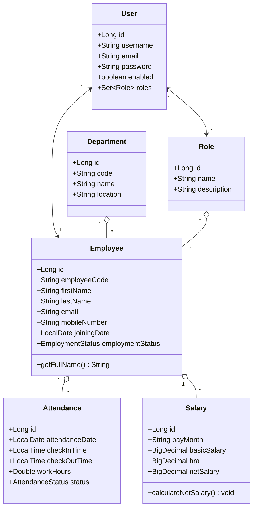
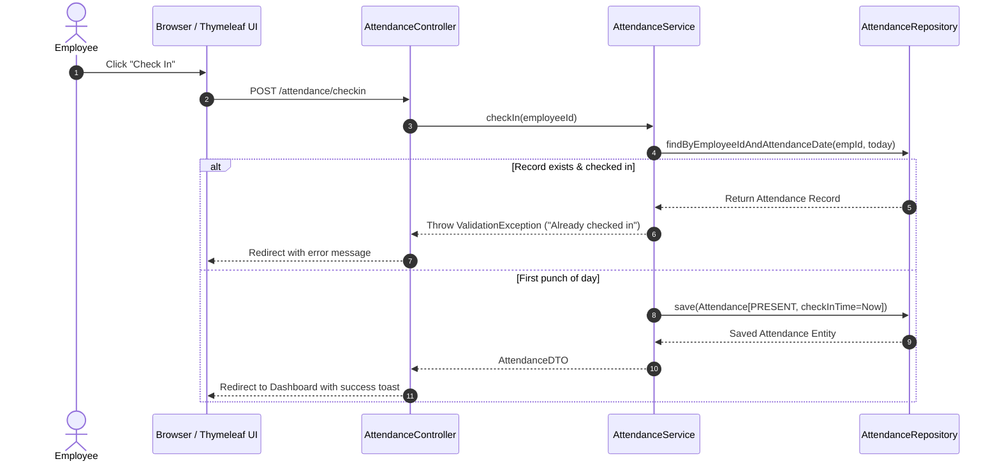

# UML Class & Sequence Diagrams

This document illustrates the Object-Oriented Architecture and key runtime interactions of the Employee Management System.

---

## 1. Class Diagram

---

## 2. Sequence Diagram - Employee Check-In Workflow

